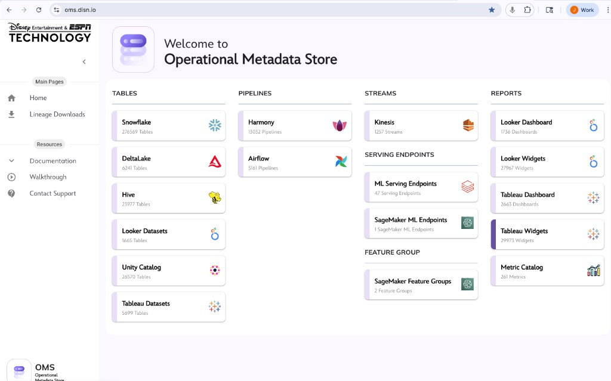
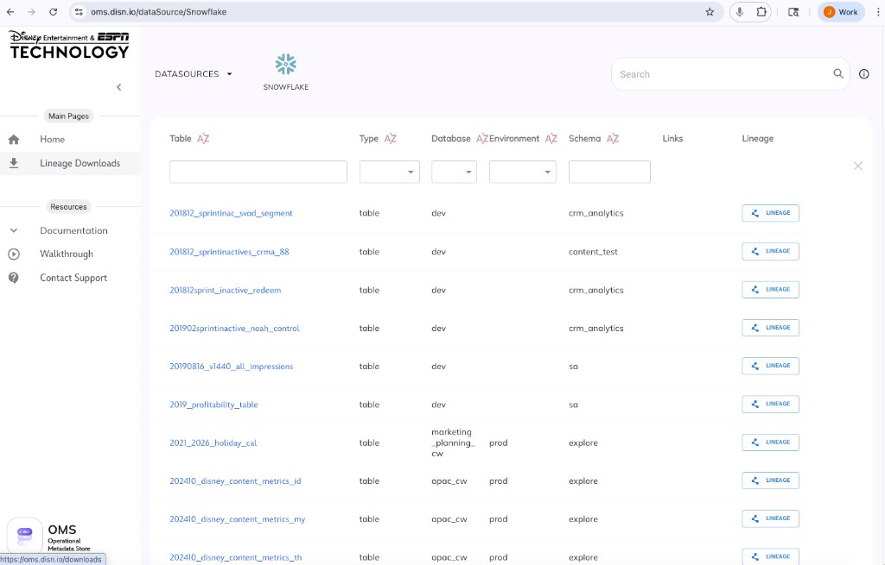
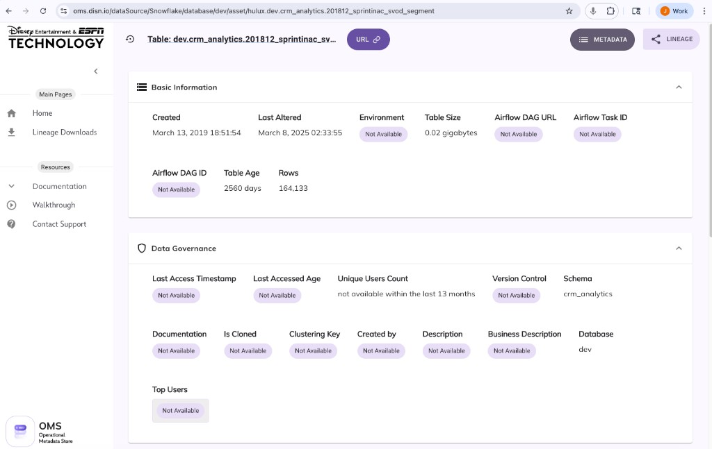

# Alation to OMS Migration: High-Level Project Plan
**Disney Streaming Services**  
**Prepared:** March 17, 2026  
**Alation Contract End Date:** October 1, 2026

---

## Executive Summary

Disney Streaming Services is transitioning from Alation (external data catalog) to OMS (Operational Metadata Store, internal Disney service). OMS currently focuses on technical metadata; this project will extend OMS to absorb business metadata and data catalog capabilities previously provided by Alation.

**Critical Timeline:** ~6.5 months remain until Alation contract end (Oct 1, 2026).

---

## Current OMS Capabilities & UI (Evidence)

The following screenshots from OMS (oms.disn.io) document the current state as of March 2026. This evidence informs the gap analysis in Section 2.

### OMS Home Dashboard — Inventory Summary

**Figure 1.** OMS home/dashboard: inventory summary of tables, pipelines, streams, serving endpoints, feature groups, and reporting objects (oms.disn.io).

**Current OMS inventory (validate with source teams):**

| Category | Source | Count |
|----------|--------|-------|
| **Tables** | Snowflake | 275,659 |
| | DeltaLake | 6,241 |
| | Hive | 23,977 |
| | Looker Datasets | 1,665 |
| | Unity Catalog | 26,570 |
| | Tableau Datasets | 5,699 |
| **Pipelines** | Harmony | 13,032 |
| | Airflow | 561 |
| **Streams** | Kinesis | 1,257 |
| **Reports** | Looker Dashboard/Widgets | 1,756 / 27,967 |
| | Tableau Dashboard/Widgets | 2,663 / 29,973 |
| | Metric Catalog | 261 |

### OMS Snowflake Datasource UI — Table List

**Figure 2.** OMS Snowflake datasource UI: table list with filtering and per-row Lineage action.

**What OMS currently shows:** Table (clickable link), Type, Database, Environment, Schema, Links, Lineage button. Filter controls under each column header; global search box. **Gaps vs. Alation:** No business glossary terms, ownership, description, or tags visible in the list view.

### OMS Table Detail Page — Basic Information & Data Governance

**Figure 3.** OMS table detail UI — many business/governance fields show "Not Available."

**Field population status (example table):**

| Field | Status |
|-------|--------|
| Created, Last Altered, Rows, Table Size, Table Age, Schema, Database | Populated (technical metadata) |
| Environment, Airflow DAG URL, Airflow Task ID, Airflow DAG ID | Not Available |
| Last Access Timestamp, Last Accessed Age, Unique Users Count | Not Available |
| Version Control, Documentation, Created by, Description, Business Description | Not Available |
| Top Users, Is Cloned, Clustering Key | Not Available |

**Gap pattern:** Technical metadata is present; business/governance metadata and usage/lineage/Airflow links are largely missing. OMS has UI placeholders — they need to be populated via integrations and stewardship.

**Priority items for Alation parity:** Documentation/Business Description, access/usage metrics, lineage/Airflow integration, owners/created-by, version control, top users.

---

## 1. Project Approach & Key Considerations

### Recommended Approach: Phased, Metadata-First

| Principle | Rationale |
|-----------|-----------|
| **Metadata-first** | Business metadata (glossary, descriptions, tags, lineage context) drives adoption. Technical metadata can be re-ingested; business context cannot. Preserving 95%+ of business metadata is a leading indicator of success. |
| **Phased rollout** | Phased rollouts reduce incidents by ~60% vs. big-bang cutover. Run Alation and OMS in parallel during transition. |
| **Governance-led** | Data governance team owns requirements, acceptance criteria, and adoption. Engineering owns build; governance owns “what” and “why.” |
| **Risk-based prioritization** | Not all Alation features are equal. Prioritize by user impact, compliance needs, and migration complexity. |

### What to Consider Most

1. **Scope creep** — Clearly define MVP vs. Phase 2. Avoid “Alation parity” as a goal; aim for “critical business metadata parity.”
2. **Change management** — Users are attached to Alation workflows. Plan for resistance, training, and champions.
3. **Data fidelity** — Migration quality matters more than speed. Validate lineage, glossary mappings, and article/documentation links.
4. **OMS roadmap alignment** — OMS is a Disney-wide service. Ensure your requirements fit OMS’s roadmap and don’t conflict with other business units.
5. **Integration dependencies** — Identify downstream systems (BI tools, data quality, governance workflows) that consume Alation today.
6. **Compliance & audit** — Document what governance controls exist in Alation today and ensure OMS can support them (e.g., policy attestation, access logs).

---

## 2. Documenting OMS Gaps That Alation Currently Serves

### Alation Capabilities vs. OMS (Evidence-Based)

Based on OMS screenshots (Section above) and Alation product capabilities:

| Capability | Description | OMS Gap Assessment (Evidence) |
|------------|-------------|------------------------------|
| **Search & Discovery** | Keyword + semantic search across tables, schemas, columns, articles, glossary terms | OMS has technical search (column filters, global search). **Gap:** No business-context search; no glossary/article search. |
| **Business Glossary** | Terms, definitions, synonyms, stewardship | **Gap:** No glossary visible in OMS UI. Table list shows no glossary terms. |
| **Documentation / Business Description** | Descriptions linked to catalog objects | **Gap:** Table detail shows "Documentation" and "Business Description" as "Not Available." UI placeholders exist; need population. |
| **Data Lineage** | Upstream/downstream lineage (table, column, dataflow level) | OMS has Lineage button per row; Lineage Downloads in nav. **Gap:** Airflow DAG/Task links show "Not Available" for this table. |
| **Tags & Custom Fields** | Classification, PII flags, domain ownership | **Gap:** No tags visible in table list or detail view. |
| **Data Sources & Connectors** | 120+ connectors; datasource metadata | OMS has Snowflake, DeltaLake, Hive, Unity, Looker, Tableau, Harmony, Airflow, Kinesis, SageMaker. **Gap:** Different scope; document which sources matter for DSS. |
| **Usage / Access Metrics** | Last access, unique users, top users | **Gap:** "Last Access Timestamp," "Unique Users Count," "Top Users" show "Not Available." |
| **Ownership / Created By** | Steward, owner, created-by | **Gap:** "Created by" shows "Not Available." No ownership visible in UI. |
| **Version Control** | Asset versioning | **Gap:** "Version Control" shows "Not Available." |
| **Airflow Integration** | DAG ID, DAG URL, Task ID | OMS has UI fields for Airflow. **Gap:** All show "Not Available" for this table. |
| **Policy Center** | Policies, risk, compliance | Document governance policies in Alation; assess OMS governance model. |
| **API & Integrations** | REST APIs for bulk ops, custom metadata | OMS API coverage; integration gaps for metadata population. |

### Recommended Gap Documentation Process

1. **Inventory** (2–3 weeks): Export Alation metadata (glossary, articles, tags, custom fields, lineage). Use Alation API/MCP tools.
2. **Workflow mapping** (1–2 weeks): Interview key users (analysts, stewards, governance) on how they use Alation daily.
3. **Gap matrix** (1 week): Create a prioritized matrix: OMS has / OMS lacks / Criticality (High/Medium/Low).

---

## 3. Documenting OMS Gaps: Alation Promised but Never Delivered

### Common “Promised but Undelivered” Areas (Industry Patterns)

| Area | Typical Promise | Typical Gap |
|------|-----------------|-------------|
| **Semantic / AI search** | Natural language search | Often keyword-only or limited |
| **Column-level lineage** | Full column lineage | Often table-level or partial |
| **Automated documentation** | Auto-generated descriptions | Manual or partial |
| **Data quality integration** | Proactive quality monitoring | Often reactive or manual |
| **Compliance automation** | Policy enforcement, attestation | Manual workflows |
| **Data product marketplace** | Self-service data products | Not fully implemented |
| **Workflow automation** | Auto-add assets, improve metadata | Manual processes |

### Recommended Process

1. **Stakeholder interviews** (1–2 weeks): Ask governance, data eng, and analytics: “What did Alation promise that you never got?”
2. **Enhancement backlog** (1 week): Create a separate backlog: “OMS enhancements” (not Alation parity). Prioritize by impact and feasibility.
3. **Phase 2 roadmap**:
   - Phase 1: Alation parity (critical features only)
   - Phase 2: Enhancements (AI search, better lineage, automation)

---

## 4. Costs to Build OMS Needs

### Cost Drivers

| Component | Considerations |
|-----------|----------------|
| **Engineering** | OMS team (Disney internal) vs. DSS-dedicated engineers. OMS may have shared roadmap; DSS may need to fund or contribute. |
| **Product/BA** | Requirements, user stories, acceptance criteria. |
| **Governance** | Data governance team time for requirements, UAT, stewardship model. |
| **Infrastructure** | Storage, compute, connectors for new metadata types. |
| **Third-party** | Any new tools (e.g., lineage engine, search) if OMS doesn’t have them. |

### Rough Order-of-Magnitude (ROM) Estimates

| Phase | Duration | Effort (FTE-months) | Notes |
|-------|----------|---------------------|-------|
| MVP (critical Alation parity) | 3–4 months | 4–8 | Glossary, search, basic lineage, tags, articles |
| Full parity | +2–3 months | 4–6 | Custom fields, governance workflows, integrations |
| Enhancements | +2–4 months | 4–8 | AI search, automation, compliance features |

**Recommendation:** Get a formal estimate from the OMS team. Clarify:
- Who funds (DSS vs. central OMS budget)
- Whether OMS is building for DSS only or for all of Disney
- Shared vs. dedicated engineering capacity

---

## 5. Migration Costs and Plans

### Migration Phases (Industry Best Practice: 3–6 months)

| Phase | Duration | Activities | Cost Drivers |
|-------|----------|------------|--------------|
| **Assessment & Discovery** | 2–4 weeks | Inventory metadata, map dependencies, stakeholder interviews | BA, governance time |
| **Planning & Design** | 4–6 weeks | Transformation mappings, phased rollout, success metrics | PM, architect |
| **Execution** | 6–12 weeks | Phased metadata migration, parallel runs, validation | Eng, data migration tools |
| **Validation & Optimization** | 2–4 weeks | Data fidelity, UAT, lineage verification | QA, governance |

### Migration Cost Categories

| Category | Examples |
|----------|----------|
| **Labor** | Migration scripts, ETL, validation, reconciliation |
| **Tools** | Migration/ETL tools, temporary storage |
| **Parallel run** | Extended Alation (if negotiated) during migration |
| **Contingency** | 15–20% for rework |

### Risk: Weak Planning

Organizations often fail due to inadequate migration strategy rather than technical complexity. Poor planning can lead to rework costs in the millions. Invest in upfront planning.

---

## 6. Training Costs and Plans

### Training Needs

| Audience | Topics | Format | Est. Effort |
|----------|--------|--------|-------------|
| **Data stewards** | New glossary, tagging, stewardship workflows | Workshop + hands-on | 2–4 hours |
| **Analysts** | Search, discovery, lineage in OMS | Self-serve + office hours | 1–2 hours |
| **Governance** | Policy center, compliance, reporting | Workshop | 2–3 hours |
| **Engineers** | OMS lineage, metadata ingestion | Technical docs + sessions | 2–4 hours |

### Training Plan Components

1. **Training materials**: Quick guides, videos, FAQs (vs. Alation).
2. **Champions program**: Identify power users in each org to support adoption.
3. **Office hours**: 2–4 weeks post-launch.
4. **Feedback loop**: Survey adoption; iterate on materials.

### Cost Estimate

| Item | Approx. Cost |
|------|--------------|
| Content creation | 40–80 hours (BA, governance) |
| Delivery (workshops, office hours) | 20–40 hours |
| Champions program | 10–20 hours |

---

## 7. Timing: Contract End Oct 1, 2026

### Current Situation

- **Today:** March 17, 2026  
- **Alation contract end:** October 1, 2026  
- **Time remaining:** ~6.5 months  

### Recommendation: Extend Alation 1 Year (to Oct 1, 2027)

**Rationale:**

| Factor | 6.5 months (no extension) | 1-year extension |
|--------|---------------------------|------------------|
| **Build time** | MVP only; high risk of cutover issues | Full parity + migration + validation |
| **Migration** | Industry best practice: 3–6 months | 3–6 months comfortably |
| **Parallel run** | Minimal or none | 2–4 months parallel run |
| **Training** | Compressed | Adequate |
| **Risk** | High | Lower |

**6.5 months is tight** for:
- Gap documentation (4–6 weeks)
- OMS build (3–6 months for MVP)
- Migration (3–6 months)
- Validation + training (4–6 weeks)

### Alternative: Negotiate 6-Month Extension (to Apr 1, 2027)

If you cannot get a full year:

- **Pros:** 12 months total; more realistic than 6.5 months.
- **Cons:** Still tight for full parity + enhancements.

### Negotiation Strategy

1. **Request 1-year extension** at current or reduced rate.
2. **Fallback:** 6-month extension.
3. **Leverage:** Alation knows you’re leaving; negotiate for favorable terms.
4. **Clarify:** Read-only access vs. full license during transition; some vendors offer “wind-down” pricing.

**Bottom line:** Target **Oct 1, 2027** as the OMS cutover date. Use the extra year for build, migration, parallel run, and training. If you must cut over by Oct 1, 2026, scope MVP aggressively and accept higher risk.

---

## 8. Data Governance Team Ownership

### Recommendation: Explicit Ownership

- **Data governance team** owns:
  - Data catalog features (glossary, stewardship, policies, compliance)
  - Requirements and acceptance criteria for OMS
  - User adoption and training
  - Steward community and champions program

- **Engineering/OMS team** owns:
  - Technical implementation
  - Integration and APIs
  - Performance and reliability

### Implementation

1. **RACI matrix**: Document roles (Responsible, Accountable, Consulted, Informed) for each capability.
2. **Governance charter**: Update governance charter to state OMS as the system of record for data catalog.
3. **Steward assignment**: Ensure stewards are assigned in OMS before cutover.
4. **Reporting**: Governance reports to leadership on adoption, quality, and compliance.

### Carve-Out in Project Plan

- Add a governance section to the project plan.
- Include governance sign-off in phase gates.
- Define governance metrics (e.g., glossary coverage, steward activity).

---

## 9. Other Considerations

| Consideration | Action |
|---------------|--------|
| **Stakeholder alignment** | Executive sponsor; steering committee (Eng, Governance, Analytics, Compliance). |
| **OMS roadmap alignment** | Align with Disney OMS team; avoid duplicate work. |
| **Vendor lock-in** | Alation data export; ensure you can extract all metadata before contract end. |
| **Compliance & audit** | Document retention, access logs, policy attestation. Ensure OMS meets audit requirements. |
| **Success metrics** | Define adoption (e.g., weekly active users), search success, glossary coverage, lineage accuracy. |
| **Rollback plan** | If OMS cutover fails, what is the fallback? (Alation extension, manual processes?) |
| **Communication plan** | Regular updates to stakeholders; timeline visibility; change management. |
| **Budget** | Total cost of ownership: build + migration + training + (optional) Alation extension. |

---

## Appendix: Suggested Project Timeline (with 1-Year Extension)

| Phase | Start | End | Key Deliverables |
|-------|-------|-----|------------------|
| Gap documentation | Mar 2026 | May 2026 | Gap matrix, prioritization |
| OMS requirements | May 2026 | Jun 2026 | Requirements doc, governance sign-off |
| OMS build (MVP) | Jun 2026 | Oct 2026 | Glossary, search, lineage, tags, articles |
| Migration planning | Jul 2026 | Aug 2026 | Migration scripts, validation plan |
| Parallel run | Oct 2026 | Jan 2027 | Alation + OMS both available |
| Migration execution | Nov 2026 | Feb 2027 | Metadata migrated, validated |
| Training | Jan 2027 | Feb 2027 | Materials, workshops, champions |
| Cutover | Feb 2027 | Mar 2027 | OMS primary; Alation read-only |
| Alation decommission | Sep 2027 | Oct 2027 | Contract end; full OMS |

---

*Document version: 1.0 | March 17, 2026*
