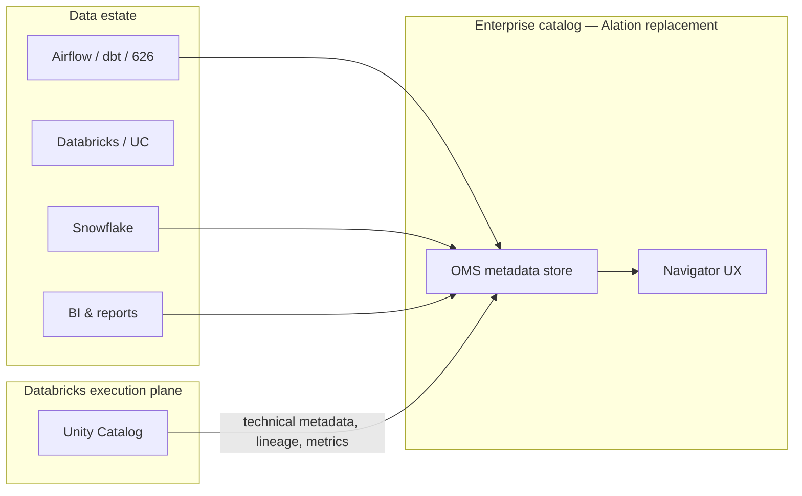

# Memo: Can Unity Catalog Replace Alation?

**Audience:** Broad leadership and data platform stakeholders (including forums where SVP questions arise)  
**Author:** Data Governance / Data Catalog program  
**Date:** June 25, 2026  
**Context:** Databricks Data + AI Summit 2026 announcements (June 15–18, 2026); Alation contract end **October 1, 2026**

---

## Executive summary

**Unity Catalog (UC) is not a substitute for our Alation replacement.** Databricks made meaningful progress at **Data + AI Summit 2026** (June 15–18) toward business-aware governance and agentic AI inside the lakehouse—especially **Unity Catalog Metrics**, **Domains**, **Unity AI Gateway**, and a teased **Business Glossary** (preview coming soon). Those capabilities are valuable for Databricks-centric workloads.

They do **not** deliver the enterprise data catalog we use today: a **cross-platform** discovery and stewardship hub with a **business glossary**, articles, bulk governance, and workflows for non-technical users across Snowflake, pipelines, and BI—not only assets governed inside Databricks.

**Recommendation:** Continue the **OMS + Navigator** path as the Alation replacement. Treat Unity Catalog as a **governed metadata source and execution-plane control** for Databricks assets (hub-and-spoke), not as the enterprise catalog of record.

---

## Why this question is surfacing now

At **Data + AI Summit 2026**, Databricks positioned Unity Catalog as the control plane for data, AI, and agents:

| Announcement | Status (per Databricks) | What it does |
|--------------|-------------------------|--------------|
| **Unity Catalog Metrics / Business Semantics** | Available / GA | Governed KPIs and metric views at the data layer; SQL-addressable; synonyms/display names for AI/BI |
| **Business Glossary** | **Preview coming soon** (not GA at Summit) | Authoritative business concepts, terms, taxonomies—linked to data |
| **Domains** | Public Preview | Organize assets by business area; marketplace browse for humans and agents |
| **Unity AI Gateway** | Beta | Runtime governance for models, agents, MCPs, tools—guardrails, budgets, audit |
| **Governance Hub** | Private Preview | Steward/admin command center for Databricks estate posture |
| **External lineage** | GA | Ingest lineage from systems outside Databricks (e.g., via Lakeflow Connect) |
| **Certifications, ABAC, classification, DQ monitoring** | Beta / expanding | Trust signals and automated policy enforcement |
| **Cross-region / cross-cloud governance** | Preview roadmap | Consistent policies across Databricks footprint |

Databricks marketing frames UC as “the industry’s only unified governance solution for data and AI.” That naturally raises whether a separate catalog investment is still needed.

**Short answer for executives:** UC is a strong **platform governance layer** for Databricks. It is **not** a drop-in replacement for Alation in a heterogeneous enterprise like ours.

---

## What Unity Catalog is—and is not

### What UC does well (especially after DAIS 2025)

1. **Technical governance inside Databricks** — Centralized permissions, auditing, and lineage for tables, volumes, models, and functions across workspaces.
2. **Semantic metrics layer** — Metric Views define KPIs once with governance, lineage, and reuse across SQL, notebooks, AI/BI Dashboards, Genie, and (roadmapped) external BI tools.
3. **Lakehouse-native trust signals** — Certification tags, deprecation warnings, classification, ABAC, and data quality health indicators tied to UC-managed assets.
4. **Discovery for Databricks users** — Discover (preview) and Catalog Explorer improve findability **within** the Databricks experience.
5. **Evolving cross-system lineage** — External lineage / “bring your own lineage” (BYOL) allows programmatic ingestion of metadata from outside Databricks—**but operational ownership of those integrations falls to our engineering teams**.

Industry commentary (including the Architect Mindset analysis [*Is Unity Catalog Enough?*](https://www.youtube.com/watch?v=CVqucyacECU)) converges on a similar pattern: UC is increasingly a **structural metadata engine** for the lakehouse; enterprise catalogs remain the **federation and collaboration layer** for the full estate.

### What UC is not (for our Alation parity bar)

| Alation capability we rely on | Unity Catalog today | Gap |
|------------------------------|---------------------|-----|
| **Business glossary** (terms, definitions, synonyms, stewardship, links to columns/tables) | **Not available today.** DAIS 2026 announced Glossary as **“preview coming soon”**—not GA. Business Semantics today = **Metric Views** + agent metadata on measures/dimensions—not a stewarded vocabulary of business concepts independent of KPI SQL. | **Critical gap** (even post-Summit) |
| **Articles / document hubs** | No equivalent knowledge base with folder IA, collaborative docs, and deep links to assets | **Critical gap** |
| **Cross-platform catalog** (Snowflake DSS/Hulu/DTCI, Airflow, dbt, Harmony, reports) | Primary scope is Databricks-governed assets. Federation/BYOL can **reference** external objects but does not replace managed crawlers and unified search across our full stack | **Critical gap** |
| **Stewardship workflows** (ownership assignment at scale, documentation completion, approval pipelines) | Limited steward curation in Discover preview; no policy-style workflow layer comparable to Alation | **Major gap** |
| **Bulk governance** (mass edit, catalog sets / rules) | Tag policies and ABAC help at scale **inside UC**; not equivalent to Alation bulk metadata operations across all connected sources | **Major gap** |
| **Consumer-friendly discovery for business users** | Discover is Databricks-native and still maturing (private preview). Our personas expect a **governed Navigator** experience on OMS, not Catalog Explorer | **Major gap** |
| **Compose / saved queries in catalog** | SQL warehouses and notebooks—not catalog-first query sharing with glossary linkage | Moderate gap |
| **Admin analytics & adoption telemetry** | Platform audit logs and usage signals exist; not the same as catalog MAU / stewardship analytics | Moderate gap |

**Bottom line:** Your instinct is correct. **UC does not provide Alation-style business glossary and enterprise catalog capabilities today**—and Databricks only *announced* a Glossary preview at DAIS 2026, not a shipped product. Recent announcements narrow the gap for **metrics semantics**, **domains**, and **Databricks-native discovery**, not for the full governance catalog program.

---

## Fit for Disney Streaming’s context

### Our estate is multi-platform

Alation today federates metadata across sources our teams actually use—e.g. multiple Snowflake accounts, pipeline systems, and documentation—not only Unity-managed Delta tables. OMS already aggregates **technical inventory** across Snowflake, Delta, Hive, Harmony, Airflow, and more ([Product Brief](Product-Brief-Alation-to-OMS-Migration.md)).

Unity Catalog’s strongest enforcement (masking, ABAC, permissions) stays **coupled to Databricks compute**. When data is consumed in Snowflake, Tableau, or internal APIs, UC policies do not automatically become the enterprise control plane.

### Our committed direction

We are building **OMS as the metadata store** and **Navigator as the business-first catalog experience** for Alation exit by **October 1, 2026**. That path explicitly includes glossary, search, asset detail, classifications, and stewardship signals ([In-House Data Catalog Pitch Deck](In-House-Data-Catalog-Pitch-Deck.md)).

Pivoting to UC as the Alation replacement would:

- **Fragment** discovery (Databricks UI vs Snowflake/Horizon vs OMS)
- **Duplicate** glossary and stewardship work—or leave it undefined
- **Miss the contract window** while waiting on UC Glossary (preview not yet available) and Governance Hub (private preview)
- **Shift cost** from catalog licensing to **integration engineering** (BYOL pipelines per source)

---

## Recommended architecture: complement, don’t substitute

**Principles** (aligned with industry hub-and-spoke guidance):

1. **One system of record per metadata type** — Avoid dual-writing glossary, ownership, or PII tags in both UC and OMS/Navigator.
2. **OMS + Navigator = enterprise catalog control plane** for discovery, glossary, articles, and cross-platform stewardship.
3. **Unity Catalog = governed execution plane** for Databricks—source of truth for UC-managed schemas, permissions, lineage, and metric views.
4. **Sync, don’t fork** — Ingest UC metadata into OMS (APIs/crawlers) so business users find Databricks assets in the same search experience as Snowflake tables.
5. **Revisit when UC Glossary GA’s** — If Databricks ships a mature, API-addressable glossary with asset linking and stewardship, evaluate **feeding OMS**—not replacing the enterprise catalog.

---

## Talking points for leadership forums

**If asked: “Can we just use Unity Catalog instead of building in-house?”**

> Unity Catalog got materially stronger at DAIS 2026 for **governed metrics, domains, and AI agent governance**, but it still doesn’t give us a **shipped business glossary**, **cross-platform catalog**, or **stewardship workflows** across Snowflake and the rest of our stack. It’s the right control plane **inside Databricks**; OMS and Navigator remain the right answer for **replacing Alation** by October.

**If asked: “Are we duplicating Databricks?”**

> No—if we integrate cleanly. UC governs lakehouse execution; OMS federates the estate; Navigator is the experience business users and stewards actually need. That’s the same pattern Databricks partners describe with enterprise catalogs (hub-and-spoke), except OMS is our internal hub.

**If asked: “Should we pause the OMS program?”**

> No. UC’s new features reduce risk for **Databricks metrics consistency**, not for **Alation exit**. Pausing leaves us without a glossary, articles, and cross-source discovery when the Alation contract ends.

---

## What to watch on the Databricks roadmap

| Item | Why it matters | Action |
|------|----------------|-------|
| **UC Glossary (preview / GA)** | Could supply business term definitions if mature and API-accessible | Track; plan OMS ingestion, not catalog pivot |
| **Discover GA** | May improve Databricks-only business user experience | Useful for Databricks-heavy personas; not a full Alation substitute |
| **External lineage / BYOL maturity** | Reduces lineage gaps for non-Databricks systems | Evaluate engineering cost vs OMS/626 lineage supply |
| **Metric Views in external BI** | Helps KPI consistency for Tableau/Power BI on Databricks | Complements metrics governance; separate from glossary |

---

## Conclusion

Databricks Unity Catalog is **essential** for how we govern data and AI **on Databricks**. It is **insufficient** as the enterprise replacement for Alation.

We should **accelerate**, not redirect, the OMS + Navigator program—and **define integration** with Unity Catalog so Databricks assets are first-class citizens in the catalog we are already building.

---

## Sources

- [What’s new with Unity Catalog at Data + AI Summit 2026](https://www.databricks.com/blog/whats-new-unity-catalog-data-ai-summit-2026) — Databricks blog, June 2026
- [What’s new with Unity Catalog at Data + AI Summit 2025](https://www.databricks.com/blog/whats-new-databricks-unity-catalog-data-ai-summit-2025) — prior-year context (Metrics, Discover)  
- [Unity Catalog Business Semantics GA](https://www.databricks.com/blog/redefining-semantics-data-layer-future-bi-and-ai) — Metric Views, open-source semantics  
- [Unity Catalog business semantics docs](https://docs.databricks.com/aws/en/business-semantics/) — Metric views + agent metadata (no glossary section)  
- [Unity Catalog Semantics product page](https://www.databricks.com/product/unity-catalog/business-semantics) — Roadmap language on glossary/domains  
- [Is Unity Catalog Enough? (Architect Mindset)](https://www.youtube.com/watch?v=CVqucyacECU) — Hub-and-spoke vs enterprise catalog analysis  
- Workspace: [Product Brief](Product-Brief-Alation-to-OMS-Migration.md), [Feature Inventory Matrix](requirements-gathering/1-Feature-Inventory-Matrix.md), [Alation Functionality Reference](Alation-Functionality-Reference.md)

---

*Internal working document — Data Governance / Data Catalog program*
