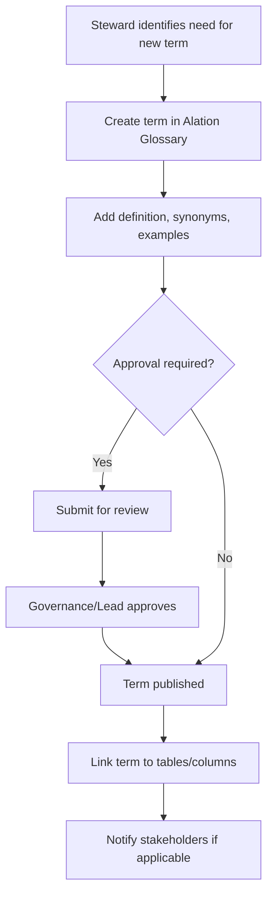
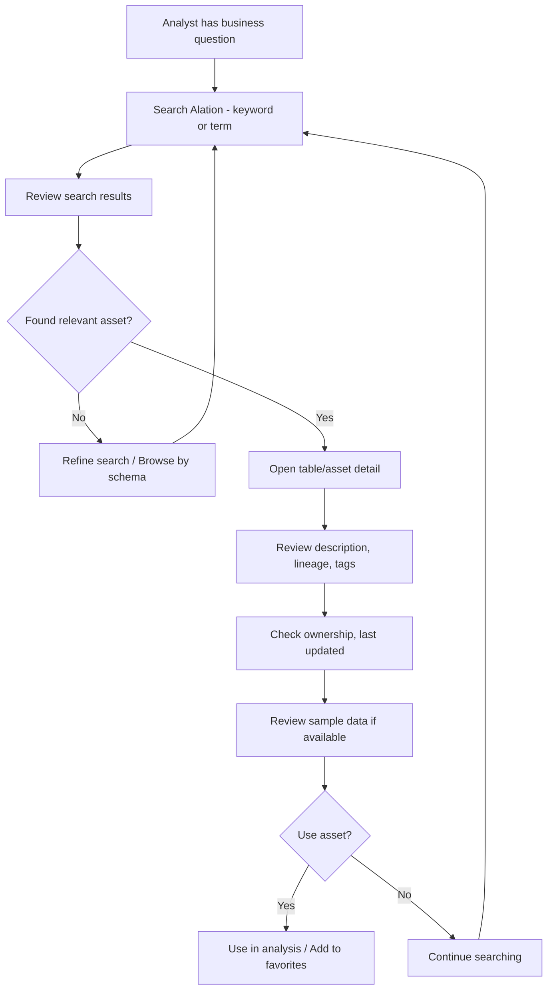
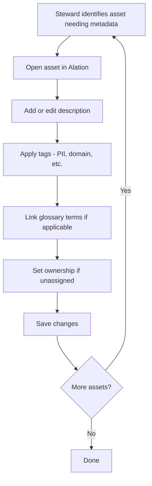
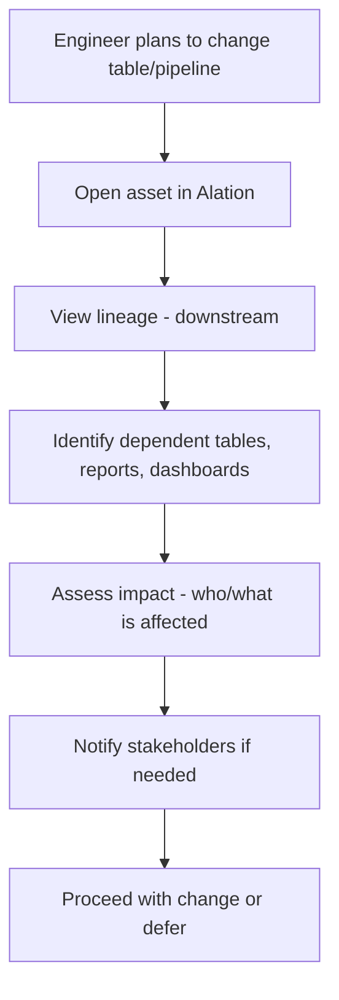
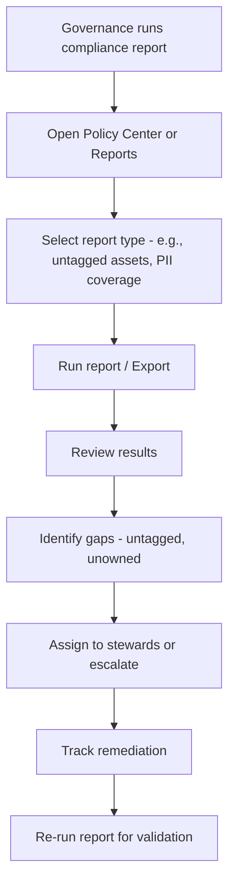

# Workflow Diagrams & Process Documentation
**Alation to OMS Migration — Current Use Documentation**  
**Disney Streaming Services** | **Version:** 1.0 | **Date:** March 19, 2026

---

## Purpose

This document captures end-to-end workflows for how Alation is used today. Use these workflows to design OMS equivalents and ensure process continuity. Validate each workflow with stakeholders during interviews.

---

## Workflow 1: Glossary Term Creation & Approval

### Description
How a new business glossary term gets created, reviewed, and published in Alation.

### Process Flow (Mermaid)

### Step-by-Step Process

| Step | Actor | Action | Alation Location / Tool |
|------|-------|--------|-------------------------|
| 1 | Data Steward | Identifies need for new term (e.g., from interview or data discovery) | — |
| 2 | Data Steward | Navigates to Glossary in Alation | _Glossary tab / menu_ |
| 3 | Data Steward | Clicks "Create Term" or equivalent | _Glossary UI_ |
| 4 | Data Steward | Enters term name, definition, synonyms, examples | _Term form_ |
| 5 | Data Steward | Submits for approval (if workflow enabled) | _Submit button_ |
| 6 | Governance / Lead | Reviews and approves term | _Approval queue / notification_ |
| 7 | System | Term published and available for linking | — |
| 8 | Data Steward | Links term to relevant tables/columns | _Asset detail > Glossary_ |
| 9 | Data Steward | (Optional) Notifies domain users | _Email / Slack_ |

### Variations to Document
- [ ] Is approval required for all terms or only certain domains?
- [ ] Who can create vs. approve terms?
- [ ] Are there term templates or required fields?

### OMS Requirements
- Glossary creation UI
- Approval workflow (or equivalent)
- Ability to link terms to tables/columns

---

## Workflow 2: Data Discovery (Analyst Finding a Table)

### Description
How an analyst typically searches for and evaluates a data asset before using it in a report or analysis.

### Process Flow (Mermaid)

### Step-by-Step Process

| Step | Actor | Action | Alation Location / Tool |
|------|-------|--------|-------------------------|
| 1 | Analyst | Has business question or report need | — |
| 2 | Analyst | Enters search in Alation (keyword, glossary term, table name) | _Search bar (global)_ |
| 3 | Analyst | Reviews search results (tables, articles, glossary) | _Search results page_ |
| 4 | Analyst | If not found, browses by datasource / schema | _Catalog browse / Data sources_ |
| 5 | Analyst | Clicks on relevant table to open detail | _Asset detail page_ |
| 6 | Analyst | Reads description, business description | _Overview tab_ |
| 7 | Analyst | Reviews lineage (upstream/downstream) | _Lineage tab / section_ |
| 8 | Analyst | Checks tags (PII, domain, etc.) | _Tags section_ |
| 9 | Analyst | Checks ownership, last updated, usage | _Metadata fields_ |
| 10 | Analyst | (Optional) Views sample data | _Sample data / Preview_ |
| 11 | Analyst | Decides to use or continues search | — |
| 12 | Analyst | (Optional) Saves to favorites for future use | _Favorites / Saved_ |

### Variations to Document
- [ ] Do analysts use article search or only table search?
- [ ] How often do they use lineage vs. description?
- [ ] Do they use filters (tags, owner) in search?

### OMS Requirements
- Global search (tables, glossary, articles)
- Asset detail with description, lineage, tags, ownership
- Browse by datasource/schema
- Favorites/saved assets

---

## Workflow 3: Metadata Stewardship (Tagging & Documentation)

### Description
How a data steward adds or updates metadata (tags, description) on a catalog asset.

### Process Flow (Mermaid)

### Step-by-Step Process

| Step | Actor | Action | Alation Location / Tool |
|------|-------|--------|-------------------------|
| 1 | Steward | Identifies asset (from report, request, or backlog) | — |
| 2 | Steward | Navigates to asset (search or browse) | _Search / Catalog_ |
| 3 | Steward | Opens asset detail page | _Asset detail_ |
| 4 | Steward | Clicks Edit | _Edit button_ |
| 5 | Steward | Adds or updates description / business description | _Description field_ |
| 6 | Steward | Applies tags (e.g., PII, Sensitive, Domain) | _Tags section_ |
| 7 | Steward | Links relevant glossary terms | _Glossary section_ |
| 8 | Steward | Assigns or updates owner if needed | _Owner field_ |
| 9 | Steward | Saves changes | _Save button_ |
| 10 | Steward | Repeats for next asset in backlog | — |

### Variations to Document
- [ ] Is there a stewardship backlog or queue?
- [ ] How are stewards assigned to assets?
- [ ] Are there bulk tagging workflows?

### OMS Requirements
- Edit metadata on assets (description, tags, ownership)
- Tag management (apply, create tags)
- Glossary linking

---

## Workflow 4: Impact Analysis (Engineer Assessing Change)

### Description
How a data engineer uses lineage to assess impact before making a change to a table or pipeline.

### Process Flow (Mermaid)

### Step-by-Step Process

| Step | Actor | Action | Alation Location / Tool |
|------|-------|--------|-------------------------|
| 1 | Engineer | Plans to change table, column, or pipeline | — |
| 2 | Engineer | Searches or browses to find asset in Alation | _Search / Catalog_ |
| 3 | Engineer | Opens asset detail | _Asset detail_ |
| 4 | Engineer | Clicks Lineage or opens Lineage tab | _Lineage section_ |
| 5 | Engineer | Views downstream lineage (what consumes this asset) | _Lineage diagram_ |
| 6 | Engineer | Identifies dependent tables, reports, dashboards, pipelines | — |
| 7 | Engineer | Assesses impact (e.g., 5 reports, 2 pipelines) | — |
| 8 | Engineer | Notifies stakeholders if change is breaking | _Email / Slack_ |
| 9 | Engineer | Proceeds with change or defers based on impact | — |

### Variations to Document
- [ ] Is lineage used at table-level or column-level?
- [ ] Do engineers use lineage for upstream (source) analysis too?
- [ ] Is there integration with Airflow or other orchestration?

### OMS Requirements
- Lineage view (downstream, upstream)
- Table and ideally column-level lineage
- Links to reports, dashboards, pipelines

---

## Workflow 5: Compliance & Compliance Reporting

### Description
How governance/compliance runs reports and ensures policy adherence in Alation.

### Process Flow (Mermaid)

### Step-by-Step Process

| Step | Actor | Action | Alation Location / Tool |
|------|-------|--------|-------------------------|
| 1 | Governance | Needs to assess compliance (e.g., quarterly) | — |
| 2 | Governance | Navigates to Policy Center or Reports | _Policy Center / Reports_ |
| 3 | Governance | Selects report type (untagged assets, PII coverage, ownership, etc.) | _Report UI_ |
| 4 | Governance | Runs report, applies filters if needed | _Run / Export_ |
| 5 | Governance | Review results (list of assets, counts) | _Report output_ |
| 6 | Governance | Identifies gaps (e.g., 50 tables untagged) | — |
| 7 | Governance | Assigns remediation to stewards | _Email / Ticket_ |
| 8 | Governance | Tracks remediation over time | _Spreadsheet / Alation_ |
| 9 | Governance | Re-runs report to validate remediation | _Report_ |

### Variations to Document
- [ ] What report types are used most?
- [ ] How often are reports run (monthly, quarterly)?
- [ ] Is there a formal attestation workflow?

### OMS Requirements
- Reporting on metadata coverage (tags, ownership, glossary)
- Export capability
- Policy/ compliance reporting

---

## Workflow Summary Table

| Workflow | Primary Persona | Key Alation Features | OMS Priority |
|----------|-----------------|---------------------|--------------|
| Glossary term creation | Data Steward | Glossary, approval | High |
| Data discovery | Analyst / BI | Search, asset detail, lineage | High |
| Metadata stewardship | Data Steward | Tags, description, glossary link | High |
| Impact analysis | Data Engineer | Lineage | High |
| Compliance reporting | Governance | Policy Center, Reports, Export | Medium |

---

## Validation Checklist

- [ ] Each workflow validated with at least one stakeholder
- [ ] Step-by-step tables completed with actual Alation locations
- [ ] Variations documented
- [ ] OMS requirements captured for each workflow

---

*Document owner: Data Governance | Update after stakeholder interviews*
